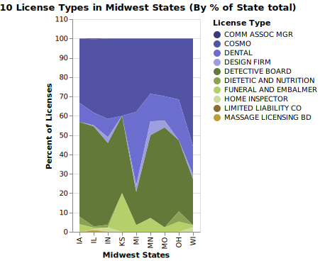

### Visualization 1: License Type Distribution by Region 

This plot displays the distribution of license types across different U.S. regions. I first mapped each state to their respective region - I divided the US into 6 including a distinction between the Inner West and Pacific Coast states. This is to see if there are license type variations by region that generally shares similar geographical, cultural and/or economic factors. I chose stacked bar chart as it is one of the optimal ways to show how categories compare to each other for each state. The result turned out skewed due to Midwest having a disporportionate numerical amount of licenses applied or actively reviewed. However, the fact still remains that it is a good way to explore two multivariables against each other - the states vs the licenses types. 

### Visualization 2: Top 10 License Types in Midwest States (By % of State Total)

From the previous plot, I have realized that the Midwest is disporportionally outweighing the licenses data so this time I tried to only study the Midwest. I have filtered down the states into Midwest but even then, Illinois as a state itself turned out to be skewing again. This is okay but since I also want to actually see how the license types are popular in each state in the Mid-West, I decided to normalize the data by their porportional percentage makeup in each state. This allows for fair and useful comparison regardless of total volumne. I chose a stacked area chart (the original area chart from Vega Altair interactive example) to show each state's license type composition. 

### Interactivity Discussion
Both of the plots include an interactive legend. I chose legend selection as the interactive layer so that the user can click the license type of interest and only that corresponding bar portion will be highlighted with its color without completely hiding the rest of the data. It only blurs the rest of the data and everything remains in place, unlike rearranged interactions so users are better able to focus on their area of interest and have an easier visual comparison. 

## My Data and Code





